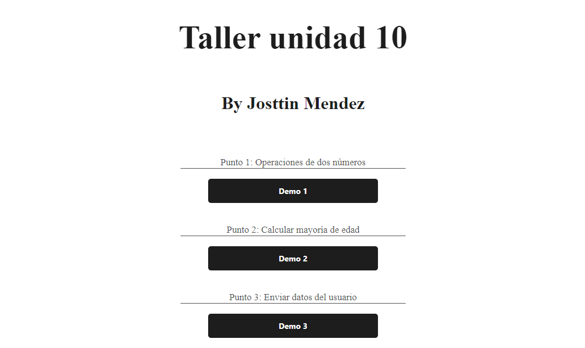

<h1>Workshop Unit 10</h1>

Course: Basic Full Stack

Instructor: Cristian Patiño

<h3>Menu</h3>
 
<h2>Task 1: </h2>

<h2>Task 2: </h2>

<h2>Task 3: </h2>

<h2>Task 3.1: </h2>

<h2>Task 4: </h2>

<h2>Task 5-6-7: </h2>
<h3>5</h3>
 
<h3>7</h3>
 